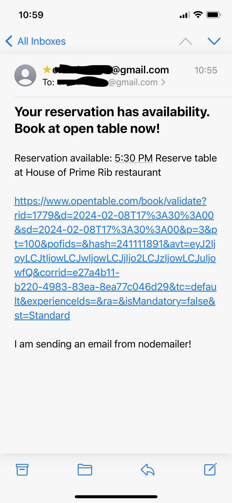
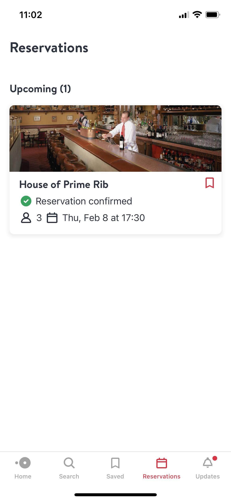
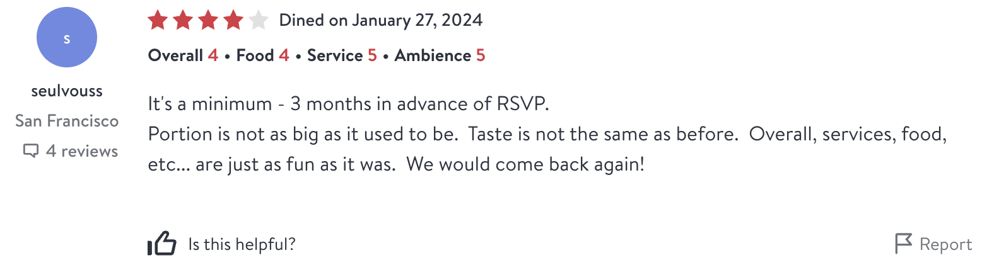

# Open-Table-Bot

A bot that enables last minute OpenTable reservations for hard to get restaurants. Let's be real, people often cancel at the last minute. Be a good citizen and help re-allocate the resources.

|               🚀               |                🌟                |
| :----------------------------: | :------------------------------: |
|  |  |

|      ⛔ because nope ⛔      |
| :--------------------------: |
|  |

## Overview

This bot runs in a tab and checks for availability. Once availability appears, it sends a notification via email with the reservation link to the destination address specified.

## Install

- clone the repo
- npm install
- create a .env file in the project root. Add the following.

```
SENDER_EMAIL=<sender email>
RECIEVER_EMAIL=<reciever email>
REFRESH_TOKEN=<refresh token>
CLIENT_SECRET=<client secret>
CLIENT_ID=<client id>
```

## Set up gmail forwarding

#### OAuth2

- login to your google cloud console
- create a project
- in credentials select create credentials and select a web client. Make sure `https://developers.google.com/oauthplayground` is set as the authorized redirect uri.
- Add client id and secret to .env
- navigate in browser to https://developers.google.com/oauthplayground/
- In select and authorized scroll down to Gmail API v1, click it and then click the https://mail.google.com/. You should see a check mark appear beside it.
- click the settings top right button on the page and click use own OAuth credentials.
- Fill in client and secret and click authorize api's button.
- in exchange authorization for refresh token, copy the refresh token and paste it into the .env
- sender email is your email, reciever is wherever you want notification to go.

#### Lower security app

- You can configure your Gmail account to allow less secure apps [here](https://www.google.com/settings/security/lesssecureapps).
  - reference - https://nodemailer.com/usage/using-gmail/
  - change auth to just use username and password. I have not tried this and cannot guarantee it works.

## Running the program

- At the project root, `npm run server`
- In the browser install tampermonkey extension. You can find it in chrome as an extension.
- In the project root tampermonkey folder, copy paste the openTableBot.js script as a new tampermonkey script
- Navigate to https://www.opentable.com/ and select a date, time and restaurant.
- Make sure the big red "Find a Time" button is visible. Otherwise clear the cache / cookies until it is.
- You should see tampermonkey running and a green button in the top left of the browser titled "Start Bot". Click it.
- You can see it run in the console. Make sure to plug in your laptop and don't let it go to sleep so you can be out and about and get notified via email on your phone for availabilities / cancellations.
